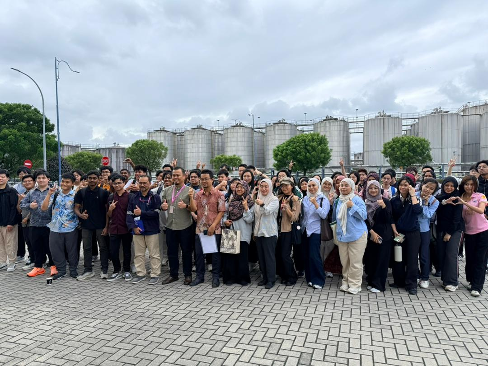

# Technology and Information System (SECP1513)

This repository documents my learning journey in **Technology and Information System (TIS)**.  
It contains 6 assignments with explanations, resources, and personal reflections.

---

# 📂 Assignments

## 1. **Video**
- **About:** Creating a short vlog to document learning experiences during UTM Digital Day.  
### Picture: 

  
### **Links:**
- [YouTube Vlog](https://youtu.be/sYgdaEgtzuI?si=OcN9H47YmHhYaP9P)  
### **Reflection:**  
- Creating a short vlog allowed me to express my learning experience in a dynamic and engaging format. I explored basic video editing techniques and learned how to communicate ideas visually. This assignment helped me build confidence in presenting and storytelling through multimedia.

---

## 2. Poster
- **About:** Designing a poster to visually communicate key concepts from the digital IT Industry talk.  
### **Picture:**
  
### PDF File:
- [Poster PDF](file/poster.pdf)  
### **Reflection:**  
- Designing the poster taught me how to distill complex information into a visually appealing layout. I experimented with typography, color balance, and hierarchy to make the content clear and attractive. It also strengthened my ability to communicate key messages quickly and effectively.

---

## 3. Academic Writing
- **About:** Writing a structured academic report on IT-related topics.   
### **PDF File:**  
- [Academic Writing Report](file/academic_writing.pdf)  
### **Reflection:**  
- This assignment deepened my understanding of formal writing and research methodology. I learned how to structure arguments, cite sources properly, and maintain academic tone throughout the report. It was a valuable exercise in critical thinking and professional communication.
---

## 4. Newsletter
- **About:** Designing a newsletter to summarize insights from the industrial visit at JohorPort Berhad.  
### **Picture:** 
  
### **Links:**  
- [Newsletter PDF](file/newsletter_industrial_visit.pdf)  
### **Reflection:**  
- Creating the newsletter helped me translate technical insights from the industrial visit into a reader-friendly format. I practiced layout design and concise writing to make the content informative yet engaging. It also gave me a taste of how media and design intersect in professional settings.
---

## 5. PC Assemble
- **About:** Hands-on activity assembling and understanding computer hardware components.  
### **Picture:** 
   
### **Reflection:**  
- Assembling a PC was a hands-on experience that connected theory to practice. I gained a clearer understanding of hardware components and how they interact to form a functional system. This task boosted my technical confidence and appreciation for the physical side of computing.
---

## 6. Design Thinking
- **About:** Applying design thinking methodology to solve problems creatively.  
### **Picture:** 
  
### **Links:**  
- [Report](file/Report_Design_Thinking.pdf)  
- [Slide Presentation](file/designthinking_slide.pdf)  
- [Video](https://drive.google.com/file/d/1v4eVpITTdq_y-FpERWYwJz9Q1iffcGZG/view?usp=sharing)  
### **Reflection:**  
- This assignment introduced me to the design thinking process — empathizing, ideating, prototyping, and testing. Working in a team, I learned how to approach problems creatively and iteratively, always keeping the user in mind. It was one of the most collaborative and eye-opening tasks in the course.
---

## 📝 Notes
- All pictures are stored in the `images/` folder.  
- PDF reports and slides are uploaded in the repository for easy access.  
- Reflections are included for each assignment to highlight personal learning outcomes.

